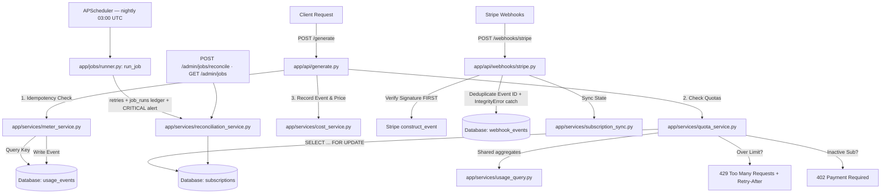

# Evaluator Presentation Prep Guide
## Multi-Tenant Usage Metering, Quota, & Billing Engine

This guide prepares you for the **6-minute live presentation demo** and the **code walkthrough** with the FlyRank evaluator. It details how the system is built, the engineering trade-offs, concurrency/error handling, and the exact files/lines of code you should know.

> Updated after the **rubric-hardening pass** (commit `76b3615`) and the **benchmarking
> pass** that measured the two headline fixes below. If you're comparing this against an
> older mental model of the codebase: the quota check now takes a row lock, there's a
> real scheduled background job with retries, and both fixes have real before/after
> numbers behind them — not just a passing test.

---

## 1. High-Level Architecture & Request Flows

The system is split into four layers to maintain **Scope Discipline** and separation of concerns:
*   **HTTP Layer (`app/api/`)**: Handles request routing, JSON parsing, and HTTP responses/exceptions. No business logic lives here.
*   **Service Layer (`app/services/`)**: Implements core business logic — idempotent recording, cost calculations, quota boundaries (with concurrency-safe locking), subscription synchronization, and shared usage aggregation.
*   **Jobs Layer (`app/jobs/`)**: A generic retry/alert job runner and the APScheduler wiring that runs the nightly Stripe reconciliation sweep.
*   **Data Layer (`app/models/`, `app/db/`)**: Houses SQLAlchemy ORM schemas and database migrations managed via Alembic (6 tables, 2 migrations).

### Core Flows Map


### Flow Paths
1.  **Billable Action Path (`POST /generate`)**:
    *   Client sends a request with `X-Tenant-ID` and `Idempotency-Key` headers.
    *   The API checks if the key is already used in [app/api/generate.py](file:///c:/Users/HP/Documents/Coding%20journeys/FlyRank%20Internship%20Stuff/Capstones/flyrank-capstone-metering-billing/app/api/generate.py#L64-L83). If it is, it returns the cached response — no new row, no quota check.
    *   The [QuotaService](file:///c:/Users/HP/Documents/Coding%20journeys/FlyRank%20Internship%20Stuff/Capstones/flyrank-capstone-metering-billing/app/services/quota_service.py) locks the tenant's subscription row (`FOR UPDATE`), checks the tenant has an active subscription (throws `402` if canceled/inactive) and enough remaining quota (throws `429` + `Retry-After` if exceeded) — **before** anything is written.
    *   The [MeterService](file:///c:/Users/HP/Documents/Coding%20journeys/FlyRank%20Internship%20Stuff/Capstones/flyrank-capstone-metering-billing/app/services/meter_service.py) computes costs (via `CostService`) and writes a `UsageEvent` row. Committing releases the lock.
2.  **Read Path (`GET /usage`)**:
    *   Retrieves aggregate usage and costs for the tenant's current billing cycle, via the *same* aggregation module the quota check uses ([app/services/usage_query.py](file:///c:/Users/HP/Documents/Coding%20journeys/FlyRank%20Internship%20Stuff/Capstones/flyrank-capstone-metering-billing/app/services/usage_query.py)) — so enforcement and reporting can never disagree.
    *   Located in [app/api/usage.py](file:///c:/Users/HP/Documents/Coding%20journeys/FlyRank%20Internship%20Stuff/Capstones/flyrank-capstone-metering-billing/app/api/usage.py) and [app/services/rollup_service.py](file:///c:/Users/HP/Documents/Coding%20journeys/FlyRank%20Internship%20Stuff/Capstones/flyrank-capstone-metering-billing/app/services/rollup_service.py).
3.  **Payment Sync Path (Stripe Checkout & Webhooks)**:
    *   User upgrades to Pro via [app/api/checkout.py](file:///c:/Users/HP/Documents/Coding%20journeys/FlyRank%20Internship%20Stuff/Capstones/flyrank-capstone-metering-billing/app/api/checkout.py) which creates a Stripe session.
    *   Stripe hits [app/api/webhooks/stripe.py](file:///c:/Users/HP/Documents/Coding%20journeys/FlyRank%20Internship%20Stuff/Capstones/flyrank-capstone-metering-billing/app/api/webhooks/stripe.py) with event callbacks (`checkout.session.completed`, `customer.subscription.updated`, `customer.subscription.deleted`).
    *   Local subscriptions are updated by [SubscriptionSync](file:///c:/Users/HP/Documents/Coding%20journeys/FlyRank%20Internship%20Stuff/Capstones/flyrank-capstone-metering-billing/app/services/subscription_sync.py).
4.  **Background Reconciliation Path (new)**:
    *   Nightly at 03:00 UTC, or on demand via `POST /admin/jobs/reconcile`, [app/jobs/runner.py](file:///c:/Users/HP/Documents/Coding%20journeys/FlyRank%20Internship%20Stuff/Capstones/flyrank-capstone-metering-billing/app/jobs/runner.py) runs [app/services/reconciliation_service.py](file:///c:/Users/HP/Documents/Coding%20journeys/FlyRank%20Internship%20Stuff/Capstones/flyrank-capstone-metering-billing/app/services/reconciliation_service.py) with up to 3 retries, records a `job_runs` row, and logs a `CRITICAL "JOB FAILURE ALERT"` if it's still failing after retries.
    *   It pulls every subscription from Stripe and repairs any local drift a missed webhook would have caused — including downgrading a tenant whose Stripe subscription was cancelled without the `customer.subscription.deleted` webhook ever arriving.

---

## 2. Deep Dive: Core Engineering Decisions & Code Blocks

### A. Idempotent Metering (Concurrent Races & DB-Level Safety)
**The Challenge**: A client retries a failed request. If we record it twice, the customer is double-billed. If multiple requests hit the server concurrently with the same key, they might bypass a simple database check (`select count(...) == 0`) and create duplicate rows.

**The Solution**:
1.  **Fast Path**: A quick `SELECT` check to see if the key exists.
2.  **Ultimate Safety**: A database-level unique constraint on `(tenant_id, idempotency_key)` in the `usage_events` table ([app/models/usage_event.py](file:///c:/Users/HP/Documents/Coding%20journeys/FlyRank%20Internship%20Stuff/Capstones/flyrank-capstone-metering-billing/app/models/usage_event.py)).
3.  **Concurrency Resolution**: If two threads attempt to write concurrently, the database blocks the second thread until the first commits or rolls back. Once the first commits, the database raises an `IntegrityError` (Unique Constraint Violation) on the second thread. The second thread catches this error, rolls back its transaction, re-queries the database to find the row written by the first thread, and safely returns it.

**Code Reference (`app/services/meter_service.py:L63-76`)**:
```python
        db.add(event)
        try:
            await db.flush()  # Flush to check database-level constraints
        except IntegrityError as e:
            await db.rollback()
            # Concurrency race condition: re-query database
            result = await db.execute(stmt)
            existing = result.scalar_one_or_none()
            if existing:
                return existing
            # If not a unique constraint collision on the key, re-raise
            raise e

        return event
```
*Validated in:* [tests/test_metering.py::test_meter_service_concurrent_race_condition](file:///c:/Users/HP/Documents/Coding%20journeys/FlyRank%20Internship%20Stuff/Capstones/flyrank-capstone-metering-billing/tests/test_metering.py#L162-L230).

---

### B. Quota Enforcement, Boundary Honesty & Concurrency-Safe Locking
**The Challenge**: Capstone rules require checking quota *before* letting an action proceed, enforcing boundary checks strictly, handling multi-dimensional quotas (tokens vs. API calls) where one request counts against both — **and** doing all of that correctly when two requests for the same tenant land at the same instant.

**The Solutions**:
*   **Simultaneous Limits**: In [app/services/quota_service.py](file:///c:/Users/HP/Documents/Coding%20journeys/FlyRank%20Internship%20Stuff/Capstones/flyrank-capstone-metering-billing/app/services/quota_service.py), a `/generate` call checks both limits.
    *   **AI Tokens**: The sum of `quantity` of all previous `ai_token` events in the billing cycle, plus the requested tokens.
    *   **API Calls**: Generates are counted as both token quantities and 1 API call. Therefore, total API calls = (sum of all `api_call` events) + (count of all `ai_token` rows). Both aggregates come from the shared [UsageQuery](file:///c:/Users/HP/Documents/Coding%20journeys/FlyRank%20Internship%20Stuff/Capstones/flyrank-capstone-metering-billing/app/services/usage_query.py) module.
*   **Boundary Honesty**: A request is allowed if `current_usage + requested_usage <= limit`. If the request puts us exactly at the limit (e.g. 100,000 of 100,000), it passes. If it exceeds it by even 1 token (e.g. 100,001 of 100,000), it is blocked.
*   **Distinct Errors & Codes**:
    *   **402 Payment Required**: Returned if a user does not have an `active` subscription status (e.g., status is `canceled`, `unpaid`, or `past_due`), or the subscription references an unknown plan.
    *   **429 Too Many Requests**: Returned if limits are hit, now carrying a `Retry-After` header (seconds until the billing window resets). Response message contains: limit, current usage, and requested amount.
*   **Concurrency-Safe Boundary (the headline fix)**: Two `/generate` calls for the *same* tenant, both at 999/1000 calls, could — without coordination — both read `current=999`, both pass, both write, and leave the tenant at **1001**. `check_quota` now opens with `SELECT ... FROM subscriptions WHERE tenant_id = $1 FOR UPDATE`: this takes a Postgres row lock on that tenant's subscription for the life of the request transaction. A second concurrent caller's identical locking `SELECT` blocks until the first commits, then re-reads and correctly sees the first caller's usage before deciding.

**Code Reference — the lock (`app/services/quota_service.py:L40-47`)**:
```python
        # 1. Load + lock the subscription row (serializes concurrent requests
        #    for this tenant until the caller commits or rolls back).
        sub_stmt = (
            select(Subscription)
            .where(Subscription.tenant_id == tenant_id)
            .with_for_update()
        )
        subscription = (await db.execute(sub_stmt)).scalar_one_or_none()
```

**Code Reference — the boundary check + `Retry-After` (`app/services/quota_service.py:L80-89`)**:
```python
        # 4. Boundary rule: allow iff current + requested <= limit.
        if current_api_calls + 1 > plan.max_api_calls:
            raise QuotaExceededException(
                message=(
                    f"Usage quota exceeded. Monthly limit is {plan.max_api_calls:,} "
                    f"API calls, current usage is {current_api_calls:,} API calls, "
                    f"requested 1 API call."
                ),
                retry_after=retry_after,
            )
```
*Validated in:* [tests/test_quota.py::test_generate_endpoint_token_quota_boundary](file:///c:/Users/HP/Documents/Coding%20journeys/FlyRank%20Internship%20Stuff/Capstones/flyrank-capstone-metering-billing/tests/test_quota.py#L91-L152) and [tests/test_quota.py::test_quota_boundary_is_race_safe](file:///c:/Users/HP/Documents/Coding%20journeys/FlyRank%20Internship%20Stuff/Capstones/flyrank-capstone-metering-billing/tests/test_quota.py#L211-L265).

**Measured, not just tested once** — see §F below: the lock takes the concurrent overcount rate from **97.5% to 0%** across 40 trials (`bench/race_condition_benchmark.py`).

---

### C. Money & Token Pricing Math (Integer-Only Policy)
**The Challenge**: Floating-point math (`0.1 + 0.2 = 0.30000000000000004`) causes rounding errors that violate financial compliance. Token prices are tiny (e.g. $1.00 per million tokens = $0.000001 per token), so storing standard cents is not precise enough.

**The Solution**:
All money calculations and database fields use **integer microcents** ($1 USD = 100 cents = 1,000,000 microcents).
*   **Token Pricing Rules**:
    *   *Input tokens*: 10 microcents ($1.00 / M)
    *   *Cached input tokens*: 2 microcents ($0.20 / M)
    *   *Output tokens*: 30 microcents ($3.00 / M)
    *   *Reasoning tokens*: 30 microcents (billed at output rate, not free)
*   **Pre-computed Summing**: Tokens in different categories are priced separately, then summed—never aggregated first before pricing.

**Code Reference (`app/services/cost_service.py:L33-39`)**:
```python
            # Categories are priced separately, then summed
            input_cost = t_input * INPUT_TOKEN_RATE
            cached_cost = t_cached * CACHED_INPUT_TOKEN_RATE
            output_cost = t_output * OUTPUT_TOKEN_RATE
            reasoning_cost = t_reasoning * REASONING_TOKEN_RATE
            
            return input_cost + cached_cost + output_cost + reasoning_cost
```
*Rates Pinned In:* [app/config/pricing.py](file:///c:/Users/HP/Documents/Coding%20journeys/FlyRank%20Internship%20Stuff/Capstones/flyrank-capstone-metering-billing/app/config/pricing.py).
*Validated in:* [tests/test_cost.py](file:///c:/Users/HP/Documents/Coding%20journeys/FlyRank%20Internship%20Stuff/Capstones/flyrank-capstone-metering-billing/tests/test_cost.py).

---

### D. Stripe Webhooks: Verification, Deduplication (Including Under Concurrency), & Downgrades
**The Challenge**: Webhooks can be replayed, forged, arrive out of order, or arrive *twice at the same instant*. We must secure our webhook endpoint and sync the local database properly with Stripe.

**The Solutions**:
1.  **Signature Verification First**: Using Stripe's raw request body and secret to verify validity **before** touching/parsing the JSON payload. A bad signature never causes a write.
2.  **Webhook Event Deduplication**: Recording the Stripe Event ID (`evt_...`) as the *primary key* of a local `WebhookEvent` row ([app/models/webhook_event.py](file:///c:/Users/HP/Documents/Coding%20journeys/FlyRank%20Internship%20Stuff/Capstones/flyrank-capstone-metering-billing/app/models/webhook_event.py)). If an ID is seen again, we abort processing immediately with a `200 OK` (so Stripe stops retrying).
3.  **Concurrent Duplicate Deliveries**: Two identical webhook deliveries racing past the fast-path `SELECT` check simultaneously would previously 500 on the second `INSERT`. The commit is now wrapped so a primary-key collision is caught and answered as a duplicate too — the same discipline as the idempotency fix in §A.
4.  **Downgrade Gracefully**: Upon subscription cancellation (`customer.subscription.deleted`), we do not lock the user out completely. We downgrade their subscription locally to the `free` plan and reset limits.
5.  **No Fabricated Dates**: If Stripe doesn't supply billing-period timestamps (varies by API version — some versions moved them under `items.data[0]`), we store `NULL` rather than inventing a window; the quota/rollup layer falls back to the calendar month.

**Code Reference — verify-then-dedupe (`app/api/webhooks/stripe.py:L46-58`)**:
```python
    # 1. Signature verification (before touching the payload).
    try:
        event = stripe.Webhook.construct_event(
            payload_bytes, stripe_signature, settings.STRIPE_WEBHOOK_SECRET
        )
    except (ValueError, stripe.error.SignatureVerificationError) as e:
        raise HTTPException(
            status_code=400, detail=f"Webhook signature verification failed: {str(e)}"
        )

    # 2. Event-id deduplication (fast path).
    if await db.get(WebhookEvent, event.id):
        return _duplicate_response()
```

**Code Reference — the concurrent-duplicate catch (`app/api/webhooks/stripe.py:L76-83`)**:
```python
    # 4. Commit both the WebhookEvent row and any subscription changes atomically.
    #    A concurrent duplicate delivery loses the unique-id race here -> treat
    #    as an already-processed duplicate (same discipline as MeterService).
    try:
        await db.commit()
    except IntegrityError:
        await db.rollback()
        return _duplicate_response()
```
*Validated in:* [tests/test_stripe_webhook.py](file:///c:/Users/HP/Documents/Coding%20journeys/FlyRank%20Internship%20Stuff/Capstones/flyrank-capstone-metering-billing/tests/test_stripe_webhook.py).

---

### E. Background Reconciliation: From a Standalone Script to a Scheduled, Retried, Alerting Job
**The Challenge**: Webhooks *will* be missed — a deploy mid-delivery, a transient failure, Stripe giving up retrying. When that happens, the local `subscriptions` mirror silently drifts from Stripe (a tenant stays Free after upgrading, or stays Pro after cancelling). A one-off script that a human remembers to run doesn't satisfy "≥1 background job with retries and a failure alert."

**The Solution**:
*   **The job body**: [app/services/reconciliation_service.py](file:///c:/Users/HP/Documents/Coding%20journeys/FlyRank%20Internship%20Stuff/Capstones/flyrank-capstone-metering-billing/app/services/reconciliation_service.py) lists every subscription on the Stripe account, repairs any local row whose `stripe_subscription_id` / `plan_id` / `status` / period-end drifted, and — in a second pass — finds local subscriptions pointing at a Stripe id that's no longer active, re-confirms via `Subscription.retrieve` (a 404 counts as canceled), and downgrades those tenants to Free.
*   **The generic retry/alert wrapper**: [app/jobs/runner.py](file:///c:/Users/HP/Documents/Coding%20journeys/FlyRank%20Internship%20Stuff/Capstones/flyrank-capstone-metering-billing/app/jobs/runner.py)'s `run_job()` inserts a `job_runs` row (`status="running"`), retries the body up to 3 times with linear back-off, then flips the row to `success` (recording which attempt won) or `failed` (storing the full traceback) — and on final failure logs `CRITICAL "JOB FAILURE ALERT: ..."`. It **never raises**, so a failing job can't silently kill the scheduler thread.
*   **The scheduler**: [app/jobs/scheduler.py](file:///c:/Users/HP/Documents/Coding%20journeys/FlyRank%20Internship%20Stuff/Capstones/flyrank-capstone-metering-billing/app/jobs/scheduler.py) wires an APScheduler `AsyncIOScheduler` with a `CronTrigger(hour=3, minute=0)` (nightly, UTC), started from the FastAPI `lifespan` when `ENABLE_SCHEDULER=true` (on by default in `docker-compose.yml`, forced off in tests).
*   **On-demand / demoable**: [app/api/admin_jobs.py](file:///c:/Users/HP/Documents/Coding%20journeys/FlyRank%20Internship%20Stuff/Capstones/flyrank-capstone-metering-billing/app/api/admin_jobs.py) exposes `POST /admin/jobs/reconcile` (run the sweep now, single-shot) and `GET /admin/jobs` (recent runs) — so you can *show* the job working live instead of waiting for 03:00 UTC.
*   **`reconcile_stripe.py`** is now a thin CLI wrapper around the same `reconcile()` function, kept for scripting/manual runs and so the existing reconciliation tests didn't need to change shape.

**Code Reference — the retry loop (`app/jobs/runner.py:L50-62`)**:
```python
    last_err: Optional[BaseException] = None
    for attempt in range(1, attempts + 1):
        try:
            async with factory() as session:
                result = await body(session)
                await session.commit()
        except Exception as e:  # noqa: BLE001
            last_err = e
            logger.warning(
                "job %s: attempt %d/%d failed: %s", job_name, attempt, attempts, e
            )
            if attempt < attempts:
                await asyncio.sleep(base_delay * attempt)
            continue
```

**Code Reference — the failure alert (`app/jobs/runner.py:L75-90`)**:
```python
    # Exhausted — persist the failure and raise the alert.
    async with factory() as session:
        jr = await session.get(JobRun, job_run_id)
        jr.status = "failed"
        jr.attempts = attempts
        jr.finished_at = datetime.now(timezone.utc)
        jr.error = "".join(
            traceback.format_exception(type(last_err), last_err, last_err.__traceback__)
        )[:4000]
        await session.commit()

    logger.critical(
        "JOB FAILURE ALERT: %s failed after %d attempt(s): %s",
        job_name, attempts, last_err,
    )
    return None
```

**Code Reference — the schedule (`app/jobs/scheduler.py:L29-47`)**:
```python
def start_scheduler() -> AsyncIOScheduler:
    global _scheduler
    if _scheduler is not None:
        return _scheduler

    _scheduler = AsyncIOScheduler(timezone="UTC")
    _scheduler.add_job(
        run_reconciliation_job,
        CronTrigger(hour=3, minute=0),
        id=RECONCILIATION_JOB,
        max_instances=1,
        coalesce=True,
        replace_existing=True,
    )
    _scheduler.start()
```
*Validated in:* [tests/test_reconciliation.py](file:///c:/Users/HP/Documents/Coding%20journeys/FlyRank%20Internship%20Stuff/Capstones/flyrank-capstone-metering-billing/tests/test_reconciliation.py) (sync + downgrade logic) and [tests/test_jobs.py](file:///c:/Users/HP/Documents/Coding%20journeys/FlyRank%20Internship%20Stuff/Capstones/flyrank-capstone-metering-billing/tests/test_jobs.py) (success ledger, retry-then-alert, the admin trigger). Also run live against real Stripe test mode during hardening: `POST /admin/jobs/reconcile` correctly detected and downgraded a stale local subscription (`{'fetched': 3, 'synced': 0, 'already_in_sync': 0, 'downgraded': 1, 'skipped': 3}`).

---

### F. Proven Impact — Benchmarked, Not Just Asserted

Two of the hardening-pass fixes have **real before/after measurements** behind them, in `bench/` (reproducible, not one-off — see `bench/RESULTS.md` for the full transcripts and exact re-run commands). These are strong things to lead with if the evaluator asks "how do you know this actually mattered":

| Fix | Benchmark | Before | After |
|---|---|---|---|
| `FOR UPDATE` lock on the quota boundary | `bench/race_condition_benchmark.py` — 40 concurrent-boundary trials per mode against real Postgres | **97.5%** of trials overcounted the limit | **0%** overcounted |
| `ix_usage_events_tenant_type_created` composite index | `bench/index_benchmark.py` — `EXPLAIN ANALYZE` on the real quota/rollup query, 100K rows / 40 tenants | **6.25ms** mean query time | **0.45ms** mean (**~13x faster**) |

To reproduce live in front of an evaluator:
```bash
docker compose up -d db
docker compose run --rm --no-deps api python bench/race_condition_benchmark.py
docker compose run --rm --no-deps api python bench/index_benchmark.py
```
Both scripts print their own methodology (what they seed, what they measure, how many
trials/runs) before printing the result, so the numbers are self-explaining on screen.

---

## 3. Preparing for the Presentation Demo (6 Minutes)

The evaluator wants to see three things: **Failure Handling** (payment required, quota exceeded, and — if time allows — the concurrency fix), **Stripe Checkout / Webhook upgrades**, and (new) **the background job**.

### Recommended Demo Script:
1.  **Start State**: Boot Docker containers (`docker compose up`) and seed a tenant:
    ```bash
    python seed_tenant.py
    ```
    *(Prints a Tenant ID, e.g. `d5b6a7a0-0000-0000-0000-000000000000`)*.
2.  **Demo Flow 1: Failure Handling & Quotas**:
    *   Show a standard generate request works:
        ```bash
        curl -X POST http://localhost:8000/generate \
          -H "Content-Type: application/json" \
          -H "X-Tenant-ID: <TENANT_ID>" \
          -H "Idempotency-Key: demo-key-1" \
          -d "{\"prompt\": \"hello\"}"
        ```
    *   Show quota exhaustion rejection (**429** + `Retry-After`). Make a request requesting 100,001 tokens (Free limit is 100,000):
        ```bash
        curl -i -X POST http://localhost:8000/generate \
          -H "Content-Type: application/json" \
          -H "X-Tenant-ID: <TENANT_ID>" \
          -H "Idempotency-Key: demo-key-2" \
          -d "{\"prompt\": \"huge request\", \"mock_usage\": {\"input_tokens\": 100001}}"
        ```
        *Output:* Shows HTTP `429 Too Many Requests` with a clear explanation of limits vs requested tokens, and a `Retry-After` header.
    *   Show idempotency behavior. Retry the first request (`demo-key-1`). It returns immediately with `200 OK` and identical outputs without creating a new event in the database.
    *   **If there's time, show the race is closed**: run `docker compose run --rm --no-deps api python bench/race_condition_benchmark.py` and point at the `97.5% -> 0.0%` line.
3.  **Demo Flow 2: Stripe Subscription Upgrade**:
    *   Trigger Checkout Upgrade:
        ```bash
        curl -X POST http://localhost:8000/checkout \
          -H "X-Tenant-ID: <TENANT_ID>"
        ```
        *Output:* Returns a `checkout_url`. Open this URL in the browser.
    *   Complete the form using Stripe test card (`4242 4242 4242 4242`).
    *   Show the webhook logs (listening via Stripe CLI):
        ```bash
        stripe listen --forward-to localhost:8000/webhooks/stripe
        ```
    *   Demonstrate that the tenant has upgraded to Pro immediately. Query `/usage`:
        ```bash
        curl -H "X-Tenant-ID: <TENANT_ID>" http://localhost:8000/usage
        ```
        *Output:* Shows `"plan_id": "pro"` and new limits. Show that the same large request from step 2 now succeeds!
4.  **Demo Flow 3: The Background Job (new)**:
    *   Trigger the reconciliation sweep on demand instead of waiting for 03:00 UTC:
        ```bash
        curl -X POST http://localhost:8000/admin/jobs/reconcile
        ```
        *Output:* A `job_runs` record — `status: "success"`, `attempts`, timestamps.
    *   Show the run history:
        ```bash
        curl http://localhost:8000/admin/jobs
        ```
        *Talking point:* "This is the mechanism that catches a missed webhook — it runs nightly automatically, retries up to 3 times with back-off, and logs a CRITICAL alert plus a queryable `job_runs` row if it's still failing after that."

---

## 4. Potential Evaluator Questions & Answers (Self-Assessment)

### Q1: How does your code handle database transaction safety during concurrent API calls with the same idempotency key?
*   **Answer**: We implement a double-layer strategy. First, we run a quick query (`SELECT`) to bypass database writes if the key is already committed. Second, we enforce a strict composite unique constraint in Postgres on `(tenant_id, idempotency_key)`. Under concurrent requests, Postgres forces sequential processing for inserts on the same index. The first transaction succeeds and flushes. The second transaction blocks, throws an `IntegrityError` when the first commits, rolls back, and catches it in [MeterService.record()](file:///c:/Users/HP/Documents/Coding%20journeys/FlyRank%20Internship%20Stuff/Capstones/flyrank-capstone-metering-billing/app/services/meter_service.py#L63-L76). It then queries the database for the newly committed row and returns it, ensuring exactly one row is stored.

### Q2: Why did you choose integer microcents instead of floating points or standard decimals?
*   **Answer**: Floating-point arithmetic (e.g., Python's `float`) is subject to representation errors (like binary rounding issues) which lead to incorrect rounding in billing. Standard decimals are safe but can add overhead in databases. Storing money as integer microcents ($1 USD = 100 cents = 1,000,000 microcents) allows us to support very low token-pricing increments (e.g., cached inputs at $0.20 per million tokens) with pure, safe integer addition and multiplication. Rounding to standard cents only happens at the presentation edge.

### Q3: How do you verify the authenticity of Stripe webhook events?
*   **Answer**: We retrieve the `Stripe-Signature` header from the webhook request and use Stripe's official SDK helper `stripe.Webhook.construct_event()` passing the raw request body and our local `STRIPE_WEBHOOK_SECRET`. This performs HMAC SHA-256 signature checks. Any verification failure throws an error immediately, returning a `400 Bad Request`, preventing malicious users from spoofing payment notifications.

### Q4: If a webhook delivery fails or the server goes down, how does local subscription status reconcile?
*   **Answer**: A nightly APScheduler job (`app/jobs/scheduler.py`, 03:00 UTC) runs the reconciliation sweep (`app/services/reconciliation_service.py`) through a generic retry wrapper (`app/jobs/runner.py`) that gives it up to 3 attempts with back-off, records a `job_runs` row for every run, and logs a `CRITICAL "JOB FAILURE ALERT"` if it's still failing after retries. The sweep queries Stripe for every subscription, compares them with local tenant subscriptions, and updates database plans, statuses, and period dates if they differ. It also checks local records pointing to defunct Stripe IDs, pulls their individual statuses, and downgrades them locally if they were canceled. It can also be triggered on demand via `POST /admin/jobs/reconcile` and inspected via `GET /admin/jobs` — useful for a demo, since you don't want to wait until 3am to show it works.

### Q5: How is data isolation enforced between tenants?
*   **Answer**: We enforce row-level scoping. Every database query that aggregates usage, pulls active plans, or inserts events explicitly filters by `tenant_id` at the database query layer (using SQL `WHERE` clauses) rather than fetching records and filtering in application memory. This ensures a tenant can never read or impact another tenant's metrics.

### Q6: You added a `FOR UPDATE` lock for the quota check — doesn't that hurt throughput? Why not something lock-free?
*   **Answer**: It does serialize `/generate` calls **for the same tenant** — the lock is scoped to one tenant's subscription row, so it doesn't affect other tenants at all. We measured the correctness win directly: `bench/race_condition_benchmark.py` shows the concurrent-overcount rate goes from 97.5% to 0% across 40 trials once the lock is in place. We haven't measured the throughput ceiling it imposes on a single very-high-QPS tenant, and we know that's the honest follow-up question — the answer there would be an atomic conditional `UPDATE ... WHERE current + q <= limit RETURNING ...` against a per-tenant counter row (no long-held lock, still exactly-once), which is the documented next step in `PROJECT_EXPLAINER.md` if that ever became a real bottleneck. We chose the row lock first because it's the most obviously correct option and the capstone's scope doesn't stress tenant-level throughput.

### Q7: How do you know your background job actually works, not just "should" work?
*   **Answer**: Three ways. First, unit tests (`tests/test_jobs.py`) directly verify the retry/alert wrapper: a job that always fails is retried exactly `attempts` times, ends in a `job_runs` row with `status="failed"` and a stored traceback, and emits a `CRITICAL` log record — a real `caplog` assertion, not a mock. Second, we ran it live against the real Stripe test-mode API via `POST /admin/jobs/reconcile` and it correctly found and downgraded a subscription that had drifted (a `sub_probe_...` id from an earlier test run that no longer existed on Stripe). Third, `GET /admin/jobs` is a durable, queryable ledger — you can point at a row and its timestamp/attempts/error, not just a log line that scrolled away.

---

## 5. Summary of Key Files

| Core File | Purpose / Logic Covered |
|---|---|
| [app/api/generate.py](file:///c:/Users/HP/Documents/Coding%20journeys/FlyRank%20Internship%20Stuff/Capstones/flyrank-capstone-metering-billing/app/api/generate.py) | API entry point, header parsing, idempotency routing, and usage recording flow. |
| [app/services/quota_service.py](file:///c:/Users/HP/Documents/Coding%20journeys/FlyRank%20Internship%20Stuff/Capstones/flyrank-capstone-metering-billing/app/services/quota_service.py) | `SELECT ... FOR UPDATE`-locked quota check. Enforces simultaneous limits (API calls and tokens), subscription status, and `Retry-After`. |
| [app/services/usage_query.py](file:///c:/Users/HP/Documents/Coding%20journeys/FlyRank%20Internship%20Stuff/Capstones/flyrank-capstone-metering-billing/app/services/usage_query.py) | Single shared "usage so far this period" aggregation, used by both quota enforcement and `/usage` reporting. |
| [app/services/meter_service.py](file:///c:/Users/HP/Documents/Coding%20journeys/FlyRank%20Internship%20Stuff/Capstones/flyrank-capstone-metering-billing/app/services/meter_service.py) | Handles request idempotency and resolves database insert race conditions. |
| [app/services/cost_service.py](file:///c:/Users/HP/Documents/Coding%20journeys/FlyRank%20Internship%20Stuff/Capstones/flyrank-capstone-metering-billing/app/services/cost_service.py) | Prices individual token categories (cached, input, output, reasoning) separately in integer microcents. |
| [app/api/webhooks/stripe.py](file:///c:/Users/HP/Documents/Coding%20journeys/FlyRank%20Internship%20Stuff/Capstones/flyrank-capstone-metering-billing/app/api/webhooks/stripe.py) | Stripe webhook verification, deduplication (incl. concurrent-insert safe) on Stripe event ID, and routing updates. |
| [app/services/subscription_sync.py](file:///c:/Users/HP/Documents/Coding%20journeys/FlyRank%20Internship%20Stuff/Capstones/flyrank-capstone-metering-billing/app/services/subscription_sync.py) | Updates subscriptions in local database and manages Free plan downgrades upon cancellations. |
| [app/jobs/runner.py](file:///c:/Users/HP/Documents/Coding%20journeys/FlyRank%20Internship%20Stuff/Capstones/flyrank-capstone-metering-billing/app/jobs/runner.py) | Generic background-job runner: retries with back-off, a durable `job_runs` ledger, and a `CRITICAL` failure alert. Never raises. |
| [app/jobs/scheduler.py](file:///c:/Users/HP/Documents/Coding%20journeys/FlyRank%20Internship%20Stuff/Capstones/flyrank-capstone-metering-billing/app/jobs/scheduler.py) | APScheduler wiring — nightly 03:00 UTC reconciliation, started from the FastAPI `lifespan`. |
| [app/services/reconciliation_service.py](file:///c:/Users/HP/Documents/Coding%20journeys/FlyRank%20Internship%20Stuff/Capstones/flyrank-capstone-metering-billing/app/services/reconciliation_service.py) | The reconciliation logic itself: pulls Stripe's subscription list, repairs local drift, catches missed cancellations. |
| [app/api/admin_jobs.py](file:///c:/Users/HP/Documents/Coding%20journeys/FlyRank%20Internship%20Stuff/Capstones/flyrank-capstone-metering-billing/app/api/admin_jobs.py) | `POST /admin/jobs/reconcile` (run now) and `GET /admin/jobs` (history) — the demoable entry points to the background job. |
| [reconcile_stripe.py](file:///c:/Users/HP/Documents/Coding%20journeys/FlyRank%20Internship%20Stuff/Capstones/flyrank-capstone-metering-billing/reconcile_stripe.py) | Thin CLI wrapper around `reconciliation_service.reconcile()` for manual/scripted runs. |
| [verify_probes.py](file:///c:/Users/HP/Documents/Coding%20journeys/FlyRank%20Internship%20Stuff/Capstones/flyrank-capstone-metering-billing/verify_probes.py) | Self-contained validation runner executing 5 Layer-2 behavioral tests on live API instances. |
| [bench/race_condition_benchmark.py](file:///c:/Users/HP/Documents/Coding%20journeys/FlyRank%20Internship%20Stuff/Capstones/flyrank-capstone-metering-billing/bench/race_condition_benchmark.py) | Measures the `FOR UPDATE` fix: 97.5% → 0% concurrent overcount rate (40 trials). |
| [bench/index_benchmark.py](file:///c:/Users/HP/Documents/Coding%20journeys/FlyRank%20Internship%20Stuff/Capstones/flyrank-capstone-metering-billing/bench/index_benchmark.py) | Measures the composite-index fix: ~13x faster quota/rollup queries at 100K rows. |
