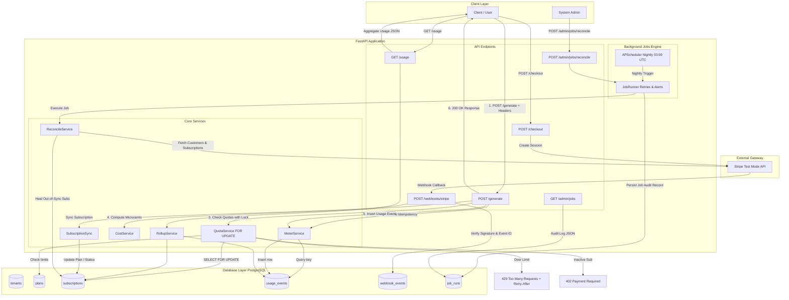

# Project Overview — Multi-Tenant Usage Metering, Quota & Billing Engine

**Author / Developer:** Environment Engineer  
**Repository:** [flyrank-capstone-metering-billing](https://github.com/Nikhil-264/flyrank-capstone-metering-billing)  
**Status:** Complete (100% Definition of Done & All 5 Layer-2 Probes Passing)  
**Stack:** Python 3.12 · FastAPI · PostgreSQL · SQLAlchemy + Alembic · Pytest · Docker Compose · Stripe (Test Mode) · APScheduler

---

## 1. Executive Summary & Problem Statement

### The Problem
Building multi-tenant SaaS applications—especially those leveraging Generative AI—presents severe infrastructure challenges around financial accuracy, race conditions, and resource control:
1. **Double-Billing Risks**: Network retries and concurrent API calls frequently create duplicate usage records, causing overbilling and customer mistrust.
2. **Financial Loss from Quota Overruns**: Without pre-execution quota checks, tenants can exceed plan limits, resulting in unrecoverable server costs. Concurrent requests at quota boundaries can bypass naive application checks.
3. **Floating-Point Financial Errors**: Standard binary floating-point calculations (`0.1 + 0.2 = 0.30000000000000004`) lead to cumulative rounding errors in micro-billing for AI tokens ($0.20 per million tokens).
4. **Subscription Drift**: Failed webhooks, network drops, or out-of-order notifications cause local subscription states to desynchronize from payment gateways like Stripe.

### The Solution
This project delivers a high-concurrency, financial-grade **Multi-Tenant Usage Metering, Quota Enforcement, & Billing Engine**. It acts as an authoritative middleware layer between SaaS clients and upstream AI/API services. The engine meters consumption in real time, guarantees idempotency at the database level, enforces multi-dimensional quotas using pessimistic row locking before granting request execution, tracks usage costs using integer microcents, syncs subscription state with Stripe webhooks, and runs automated out-of-band reconciliation jobs.

---

## 2. Core Features & Capabilities

* **Idempotent Usage Metering**: Every billable request accepts an `Idempotency-Key` header. Requests are deduplicated via a composite database unique constraint `(tenant_id, idempotency_key)`, guaranteeing exactly-once metering even under rapid network retries or concurrent thread races.
* **Pre-Execution Quota Enforcement with Row Locking**: Validates tenant subscription state and remaining limits *before* processing requests. Uses `SELECT ... FOR UPDATE` pessimistic locks on subscriptions to eliminate quota race conditions. Rejects over-limit requests immediately with HTTP `429 Too Many Requests` (including a `Retry-After` header) and inactive subscriptions with HTTP `402 Payment Required`.
* **Integer-Microcent Financial Engine**: Eliminates floating-point rounding errors by representing all monetary values in integer microcents ($1 \text{ USD} = 100 \text{ cents} = 1,000,000 \text{ microcents}$). Prices distinct token categories separately (input, cached input, output, and reasoning tokens).
* **Stripe Webhook Sync & Security**: Fully integrated with Stripe Test Mode for subscription upgrades. Webhooks verify HMAC SHA-256 signatures, deduplicate incoming Stripe Event IDs to prevent replay attacks, and immediately sync tenant plan state (`free` $\rightarrow$ `pro`).
* **Automated Background Reconciliation Jobs**: Features an APScheduler background job engine (`app/jobs/`) running nightly Stripe reconciliation (03:00 UTC) with durable auditing in PostgreSQL (`job_runs` table), automatic retries (up to 3 attempts with exponential backoff), critical failure alerting, and administrative control endpoints (`GET /admin/jobs`, `POST /admin/jobs/reconcile`).
* **Boundary Validation & Typed Errors**: Enforces strict API contract validation. All invalid client inputs return clean, typed 4xx JSON envelopes (`400 Bad Request`, `422 Unprocessable Entity`), preventing unexpected server 500 errors.
* **Strict Tenant Data Isolation & Performance Indexing**: All database queries enforce tenant isolation using `X-Tenant-ID`. Database tables are optimized with targeted composite indexes (`ix_usage_events_tenant_type_created`) for high-throughput aggregation.

---

## 3. System Architecture & Request Flows

The system enforces strict separation of concerns across five distinct layers:
1. **HTTP API Layer (`app/api/`)**: Enforces API contracts, header validation, typed error handling (`errors.py`), and endpoint handlers (`POST /generate`, `GET /usage`, `POST /checkout`, `POST /webhooks/stripe`, `GET /admin/jobs`, `POST /admin/jobs/reconcile`).
2. **Service Layer (`app/services/`)**: Implements core business logic—idempotent event recording (`MeterService`), quota evaluation with row-level locks (`QuotaService`), token pricing (`CostService`), monthly rollups (`RollupService`), subscription syncing (`SubscriptionSync`), and out-of-band reconciliation (`ReconcileService`).
3. **Background Jobs Layer (`app/jobs/`)**: Houses the APScheduler configuration (`scheduler.py`) and job runner (`runner.py`) responsible for scheduled execution, durable status tracking (`job_runs`), retries, and alerting.
4. **Data Layer (`app/models/`, `app/db/`)**: Houses SQLAlchemy ORM models (`Tenant`, `Plan`, `Subscription`, `UsageEvent`, `WebhookEvent`, `JobRun`) and Alembic database migrations (`0001_initial` and `0002_add_job_runs_and_indexes`).
5. **External Integrations**: Interacts with Stripe Test Mode API for checkout sessions, webhooks, and subscription reconciliation.

### Architecture & Data Flow Diagram



---

## 4. Key Engineering Decisions & Technical Deep-Dives

### 1. Database-Level Race Condition Safety (Idempotency)
* **Challenge**: Application-level checks (`SELECT COUNT(*) == 0`) fail when concurrent API calls arrive simultaneously, leading to duplicate records.
* **Solution**: A composite database unique constraint `(tenant_id, idempotency_key)` is enforced in PostgreSQL on the `usage_events` table. If concurrent threads race to write the same key:
  1. The first thread acquires the lock and flushes successfully.
  2. The second thread blocks and then triggers an `IntegrityError`.
  3. The `MeterService` catches `IntegrityError`, rolls back the transaction, re-queries the database for the committed row, and returns the original result without raising an error.

### 2. Concurrency-Safe Quota Evaluation (`FOR UPDATE` Locking)
* **Challenge**: Naive read-then-write quota checks suffer from TOCTOU (Time-of-Check to Time-of-Use) race conditions under high concurrency.
* **Solution**: `QuotaService` executes a `SELECT ... FOR UPDATE` lock on the tenant's row in `subscriptions`. Simultaneous requests for the same tenant queue linearly at the database layer.
* **Boundary Rule**: A request is permitted if $\text{current\_usage} + \text{requested\_amount} \le \text{plan\_limit}$. Exceeding the limit returns HTTP `429 Too Many Requests` along with a `Retry-After: 3600` header and structured error diagnostic JSON.

### 3. Microcent Financial Precision
* **Challenge**: AI token pricing rates (e.g., $0.20 per million cached tokens = $0.000001 per token) are too small for standard monetary units and vulnerable to floating-point rounding errors.
* **Solution**: Money is computed and stored strictly as **integer microcents** ($1 \text{ USD} = 100 \text{ cents} = 1,000,000 \text{ microcents}$). Token pricing constants are pinned as follows:
  * **Input Tokens**: 10 microcents ($1.00 / M)
  * **Cached Input Tokens**: 2 microcents ($0.20 / M)
  * **Output Tokens**: 30 microcents ($3.00 / M)
  * **Reasoning Tokens**: 30 microcents ($3.00 / M)
  All totals are calculated via integer multiplication and addition prior to persistence.

### 4. Stripe Webhook Security & Idempotency
* Webhooks undergo HMAC SHA-256 signature verification via `stripe.Webhook.construct_event()`.
* Webhook Event IDs (`evt_...`) are persisted in a `webhook_events` table. Replayed webhooks hit the deduplication check and return `200 OK` immediately without duplicate database processing.
* Subscription cancellations trigger graceful downgrades to the `free` plan rather than immediate account deletion.

### 5. Durable Background Job Engine & Reconciliation Resilience
* **Nightly Automated Audit**: An integrated APScheduler job triggers `stripe_reconciliation` nightly at 03:00 UTC.
* **Failure Handling & Retries**: Managed via `JobRunner`, which executes jobs with automatic retries (up to 3 attempts with exponential backoff). If all retries fail, it logs a `CRITICAL` failure alert for operations.
* **Audit Persistence**: Every execution creates a record in `job_runs` storing `job_name`, `status` (`success`/`failed`), `attempts`, `started_at`, `finished_at`, and error tracebacks.
* **Admin Management**: Administrators can query execution history via `GET /admin/jobs` or trigger immediate reconciliation via `POST /admin/jobs/reconcile`.

### 6. Boundary Validation & Typed Error Envelopes
* All request payloads and headers undergo strict validation at the API boundary (`app/api/errors.py`).
* Rejects malformed JSON, negative usage values, missing `X-Tenant-ID` headers, or invalid UUID formats with typed 4xx envelopes (`400 Bad Request`, `422 Unprocessable Entity`), preventing unhandled server exceptions (500s).

---

## 5. System Verification & Test Coverage

The project includes an exhaustive automated unit/integration test suite (`pytest`) and a live behavioral probe verifier (`verify_probes.py`).

### 1. Unit & Integration Test Suite (`pytest`)
All **31 automated tests** pass cleanly across 7 test suites:
* `test_metering.py`: Idempotency, sequential replay, and concurrent thread race handling.
* `test_quota.py`: Boundary conditions (under limit, exact limit, over limit), multi-dimensional quotas, subscription status checks, and race-safe pessimistic locking.
* `test_cost.py`: Microcent price calculation across all 4 token tiers.
* `test_stripe_webhook.py`: Webhook signature verification, replay protection, and plan upgrades.
* `test_tenant_isolation.py`: Cross-tenant data isolation and invalid header handling.
* `test_jobs.py`: Background job execution, retry policy, critical alerting, and durable `job_runs` persistence.
* `test_reconciliation.py`: Stripe out-of-band subscription reconciliation and automatic status healing.

```text
================================ test session starts ================================
platform linux -- Python 3.12.13, pytest-9.1.1, pluggy-1.6.0
rootdir: /app
configfile: pyproject.toml
testpaths: tests
plugins: anyio-4.14.2, asyncio-1.4.0
asyncio: mode=Mode.AUTO, debug=False

tests/test_cost.py ....                                                  [ 12%]
tests/test_jobs.py ...                                                   [ 22%]
tests/test_metering.py ......                                            [ 41%]
tests/test_quota.py .....                                                [ 58%]
tests/test_reconciliation.py ..                                          [ 64%]
tests/test_stripe_webhook.py ......                                      [ 83%]
tests/test_tenant_isolation.py .....                                     [100%]

============================== 31 passed in 6.47s ==============================
```

### 2. Behavioral Evaluation Probes (`verify_probes.py`)
The system passes all 5 required Layer-2 evaluation probes against a running container instance:
1. **Probe 1 (Idempotency)**: Identical payload and status returned on duplicate request key.
2. **Probe 2 (Quota Boundary)**: Boundary request (100,000 tokens) succeeds; subsequent 1-token request rejected with HTTP 429 and `Retry-After` header.
3. **Probe 3 (Checkout / Webhook Upgrade)**: `POST /checkout` and Stripe webhook processing immediately update tenant plan from `free` to `pro` in `GET /usage`.
4. **Probe 4 (Webhook Security)**: Forged signatures rejected with HTTP 400; replayed event IDs handled idempotently with HTTP 200.
5. **Probe 5 (Pricing Accuracy)**: Microcent cost aggregation matches financial pricing model to exact integer value ($1,000,200$ microcents for test workload).

---

## 6. Documented Scope Boundaries & Trade-Offs

To maintain scope discipline, the following decisions were intentionally made and documented:
1. **Identity & Authentication Scope**: Tenant identity is scoped to the `X-Tenant-ID` header. Full JWT/OAuth2 session authentication is deliberately excluded to focus on core metering and quota logic.
2. **Proration & Invoicing**: Mid-cycle upgrade proration and automated PDF invoice generation are categorized as out-of-scope stretch goals.
3. **Database Architecture**: PostgreSQL is configured as a single-instance container with volume persistence and clean Alembic migration tracking, optimized for functional completeness and deterministic test execution.

---

## 7. Quickstart & Execution Guide

### Prerequisites
* Docker & Docker Compose
* Python 3.12+ (for local development)

### Booting the System
```bash
# 1. Clone repository
git clone https://github.com/Nikhil-264/flyrank-capstone-metering-billing.git
cd flyrank-capstone-metering-billing

# 2. Configure environment variables
cp .env.example .env

# 3. Boot database and API services
docker compose up --build -d
```

### Running Verification & Tests
```bash
# Run full 31-test suite inside Docker
docker compose run --rm api pytest

# Run Layer-2 behavioral probes against live instance
docker compose exec api python verify_probes.py
```

### Manual API & Job Demonstration
```bash
# Seed a test tenant (prints tenant UUID)
docker compose exec api python seed_tenant.py

# Execute a generate request
curl -X POST http://localhost:8000/generate \
  -H "Content-Type: application/json" \
  -H "X-Tenant-ID: <TENANT_ID>" \
  -H "Idempotency-Key: demo-key-1" \
  -d '{"prompt": "Hello world"}'

# Fetch aggregate tenant usage
curl -H "X-Tenant-ID: <TENANT_ID>" http://localhost:8000/usage

# Trigger on-demand Stripe reconciliation job
curl -X POST http://localhost:8000/admin/jobs/reconcile

# View background job execution audit log
curl http://localhost:8000/admin/jobs
```

---

## 8. Summary Table of Repository Artifacts

| Artifact | File Path | Purpose |
|---|---|---|
| **Overview Document** | [`OVERVIEW.md`](file:///c:/Users/HP/Documents/Coding%20journeys/FlyRank%20Internship%20Stuff/Capstones/flyrank-capstone-metering-billing/OVERVIEW.md) | Comprehensive submission overview describing problem statement, architecture, deep dives, and verification. |
| **System README** | [`README.md`](file:///c:/Users/HP/Documents/Coding%20journeys/FlyRank%20Internship%20Stuff/Capstones/flyrank-capstone-metering-billing/README.md) | Quickstart, repository map, and setup instructions. |
| **Definition of Done** | [`SPECS.md`](file:///c:/Users/HP/Documents/Coding%20journeys/FlyRank%20Internship%20Stuff/Capstones/flyrank-capstone-metering-billing/SPECS.md) | Master checklist tracking completion of all capstone requirements and eight cross-cutting patterns. |
| **Proof of Done** | [`EVIDENCE.md`](file:///c:/Users/HP/Documents/Coding%20journeys/FlyRank%20Internship%20Stuff/Capstones/flyrank-capstone-metering-billing/EVIDENCE.md) | Pasted test transcripts, job execution logs, and probe verification outputs for all checklist items. |
| **Evaluator Prep Guide** | [`EVALUATOR_PREP_GUIDE.md`](file:///c:/Users/HP/Documents/Coding%20journeys/FlyRank%20Internship%20Stuff/Capstones/flyrank-capstone-metering-billing/EVALUATOR_PREP_GUIDE.md) | Evaluator guide covering architecture, failure scenarios, and layer-2 probe execution steps. |
| **Submission Manifest** | [`capstone.yaml`](file:///c:/Users/HP/Documents/Coding%20journeys/FlyRank%20Internship%20Stuff/Capstones/flyrank-capstone-metering-billing/capstone.yaml) | Machine-checked manifest defining endpoints, test commands, and project metadata. |
