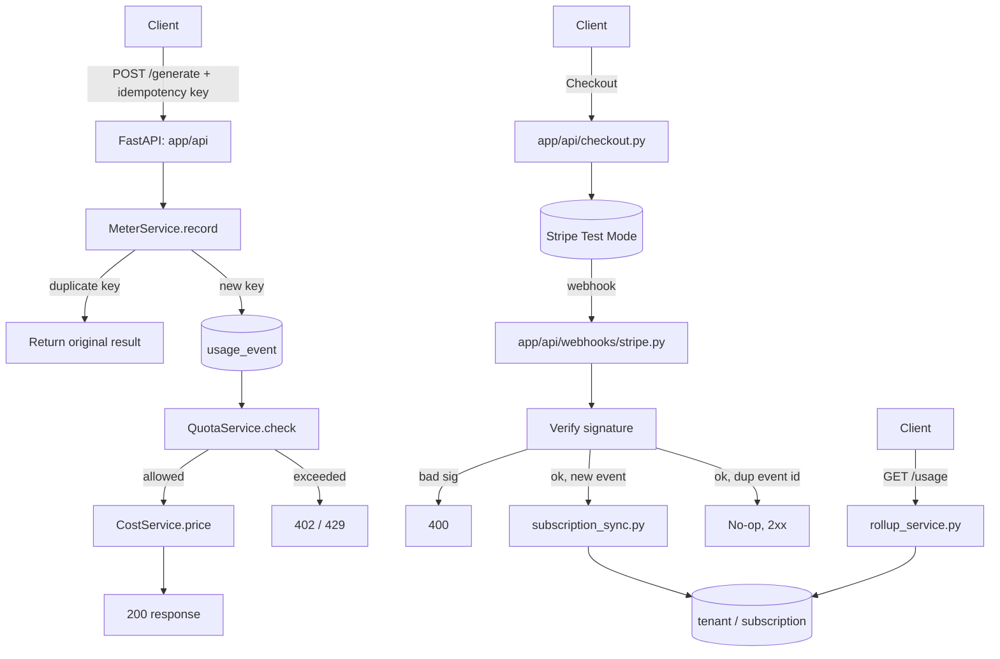

# FlyRank Capstone — Usage Metering & Billing Engine

A multi-tenant service that meters API/AI-token usage, enforces plan
quotas, computes cost, and syncs subscription state with Stripe (test
mode). Built as a Harness-Engineered project — see `AGENTS.md` for the
environment this was built inside.

> This README is a skeleton, filled in progressively as phases
> complete. Do not backfill it at the end — keep it honest as you go.

## Status
Status: **Complete** — All Definition of Done items met. See root [SPECS.md](file:///c:/Users/HP/Documents/Coding%20journeys/FlyRank%20Internship%20Stuff/Capstones/flyrank-capstone-metering-billing/SPECS.md) for details.

## Architecture



For the security model (specifically, the header-supplied identity scope and exclusion of real API key authentication), see the [Security scope section in docs/architecture.md](file:///c:/Users/HP/Documents/Coding%20journeys/FlyRank%20Internship%20Stuff/Capstones/flyrank-capstone-metering-billing/docs/architecture.md#security-scope-documented-decision-not-an-oversight).

## Stack
Python 3.12 · FastAPI · PostgreSQL · SQLAlchemy + Alembic · pytest ·
Stripe (test mode) — full rationale in `docs/stack.md`.

## Setup (must work from a clean clone)
```bash
git clone https://github.com/Nikhil-264/flyrank-capstone-metering-billing.git
cd flyrank-capstone-metering-billing
cp .env.example .env        # fill in Stripe TEST keys
docker compose up --build
```

## Run
```bash
docker compose up
```

## Test
```bash
docker compose run --rm api pytest
```

## Local Stripe webhook testing
```bash
stripe listen --forward-to localhost:8000/webhooks/stripe
stripe trigger checkout.session.completed
```

## Repo map
| Path | Purpose |
|---|---|
| `AGENTS.md` | Agent coordinator / router — read first |
| `SPECS.md` | Master Definition-of-Done checklist |
| `tasks/<phase>/SPECS.md` | Per-phase implementation checklist |
| `docs/` | Architecture & data-model pointer docs |
| `rules/` | Hard constraints (money math, idempotency, quotas, Stripe, testing) |
| `knowledge/` | Business guardrails (pricing rules, program constraints) |
| `tech-debt-tracker.md` | Intentional decisions — do not "fix" these |
| `BLOCKED.md` | Open blockers requiring a human |
| `learnings.md` | Generalized findings from building this |
| `EVIDENCE.md` | Proof-of-done per checklist item |
| `BUILDLOG.md` | Honest AI-usage log |
| `capstone.yaml` | Submission manifest |

## Non-goals
Proration calculation on mid-cycle subscription downgrades, automatic PDF invoice generation, email dispatch of invoices, and implementing real authentication/authorization mechanisms (like API keys or JWT verification, scoping identity solely to header values) are non-goals for the core engine.

## Limitations
- **Authentication & Tenant Identity Scope:** Tenant identity is identified solely by the header value `X-Tenant-ID`. There is no actual session authentication, API key validation, or token-based authorization (see the [Security scope section in docs/architecture.md](file:///c:/Users/HP/Documents/Coding%20journeys/FlyRank%20Internship%20Stuff/Capstones/flyrank-capstone-metering-billing/docs/architecture.md#security-scope-documented-decision-not-an-oversight)).
- **Database Scaling (HA):** Postgres is configured as a single-instance container with local file volume persistence, lacking high-availability (HA), read-replicas, or automatic failover clusters suitable for high-throughput production workloads.
- **Stripe Reconciliation Scheduling:** The reconciliation job `reconcile_stripe.py` is currently designed to run as an on-demand administrative script rather than being actively scheduled/cron'd as a daemon task or triggered automatically by a messaging queue.
