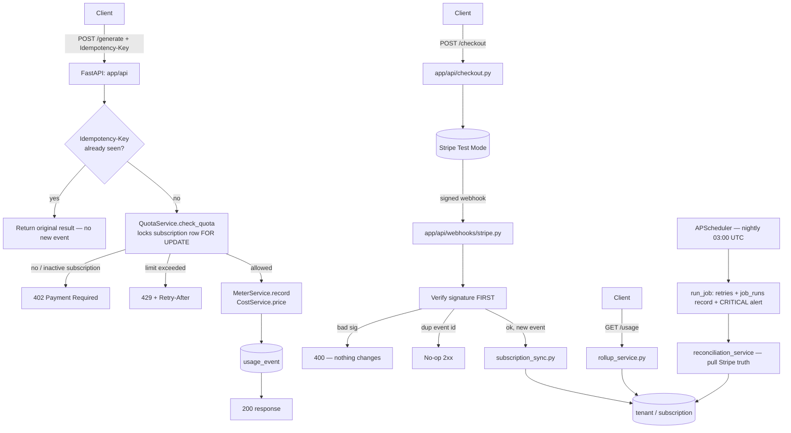

# FlyRank Capstone — Usage Metering & Billing Engine

A multi-tenant service that meters API/AI-token usage, enforces plan
quotas, computes cost, and syncs subscription state with Stripe (test
mode). Built as a Harness-Engineered project — see `AGENTS.md` for the
environment this was built inside.

## Status
Status: **Complete** — every Definition-of-Done item met, all 5 Layer-2
probes pass against a freshly-booted instance, plus a scheduled
reconciliation background job (shared-requirement #3). See root
[SPECS.md](SPECS.md).

## Architecture



Quota enforcement runs **before** the usage event is persisted (fail fast —
a rejected request never writes a row), and the tenant's subscription row is
locked `FOR UPDATE` for the request, so two concurrent `/generate` calls for
one tenant cannot both slip past the boundary. Metering idempotency is
additionally guaranteed by the `uq_tenant_idempotency_key` unique constraint.

For the security model (header-supplied identity, no real auth) see the
[Security scope section in docs/architecture.md](docs/architecture.md#security-scope-documented-decision-not-an-oversight).

## Stack
Python 3.12 · FastAPI · PostgreSQL · SQLAlchemy + Alembic · APScheduler ·
pytest · Stripe (test mode) — full rationale in `docs/stack.md`.

## Setup (must work from a clean clone)
```bash
git clone https://github.com/Nikhil-264/flyrank-capstone-metering-billing.git
cd flyrank-capstone-metering-billing
cp .env.example .env        # fill in Stripe TEST keys
docker compose up --build
```
Migrations and a demo tenant/subscription are applied automatically on
container start. A clone **without** Stripe keys still boots and serves every
endpoint; only live Checkout needs real test keys.

## Run
```bash
docker compose up
```

## Test
```bash
docker compose run --rm api pytest
```

## Behavioural probes (Layer 2)
```bash
docker compose exec api python verify_probes.py
```
Runs from inside the compose network. Override the target with
`PROBE_BASE_URL` when running elsewhere.

## Local Stripe webhook testing
```bash
stripe listen --forward-to localhost:8000/webhooks/stripe
stripe trigger checkout.session.completed
```

## Background jobs
`app/jobs/scheduler.py` (APScheduler, started from the FastAPI lifespan when
`ENABLE_SCHEDULER=true`) runs one job nightly at 03:00 UTC: a **Stripe
reconciliation sweep** that pulls Stripe's subscription list and repairs any
local drift from missed/deferred webhooks. It runs through
`app/jobs/runner.py`, which gives it up to 3 retries with back-off, a durable
`job_runs` row, and a `CRITICAL` "JOB FAILURE ALERT" log line once retries are
exhausted.

Trigger and inspect it on demand:
```bash
curl -X POST localhost:8000/admin/jobs/reconcile
curl localhost:8000/admin/jobs
```

## Endpoints
| Method & path | Purpose |
|---|---|
| `POST /generate` | Billable action — dedupe, quota check, meter, price |
| `GET /usage` | Per-tenant usage + cost rollup for the billing window |
| `POST /checkout` | Create a Stripe Checkout session (upgrade to Pro) |
| `POST /webhooks/stripe` | Verified, deduplicated subscription sync |
| `POST /admin/jobs/reconcile` | Run the reconciliation sweep now |
| `GET /admin/jobs` | Recent background-job runs |
| `GET /health` | Liveness |

## Repo map
| Path | Purpose |
|---|---|
| `AGENTS.md` | Agent coordinator / router — read first |
| `SPECS.md` | Master Definition-of-Done checklist |
| `tasks/<phase>/SPECS.md` | Per-phase implementation checklist |
| `docs/` | Architecture & data-model pointer docs |
| `rules/` | Hard constraints (money math, idempotency, quotas, Stripe, testing) |
| `knowledge/` | Business guardrails (pricing rules, program constraints) |
| `app/services/usage_query.py` | Shared usage aggregation (quota + rollup use it) |
| `app/jobs/` | APScheduler wiring + generic retry/alert job runner |
| `app/services/reconciliation_service.py` | Stripe reconciliation logic |
| `tech-debt-tracker.md` | Intentional decisions — do not "fix" these |
| `EVIDENCE.md` | Proof-of-done per checklist item |
| `BUILDLOG.md` | Honest AI-usage log |
| `capstone.yaml` | Submission manifest |

## Non-goals
Proration on mid-cycle subscription changes, automatic PDF invoice
generation, email dispatch of invoices, and real authentication/authorization
(API keys or JWT — identity is scoped to the `X-Tenant-ID` header value) are
non-goals for the core engine.

## Limitations
- **Authentication & tenant identity:** identity is solely the `X-Tenant-ID`
  header — no session auth, API-key validation, or token-based
  authorization. `tests/test_tenant_isolation.py` proves data does not leak
  *between* correctly-addressed tenants; it does not prove a caller is who
  they claim to be. The `/admin/jobs/*` routes are likewise unauthenticated.
  See the [Security scope section in docs/architecture.md](docs/architecture.md#security-scope-documented-decision-not-an-oversight).
- **Plan fee vs. metered cost:** `GET /usage` `cost_microcents` is *metered
  usage* cost only. The recurring plan fee (e.g. Pro $49/mo) lives at Stripe
  and is intentionally not added into that figure. API calls have a flat,
  count-based quota with a `$0` per-call rate.
- **Database scaling:** Postgres is a single container with a local volume —
  no HA, read replicas, or failover.
- **Reconciliation cadence:** the job runs nightly in-process via APScheduler
  (fine for a single-instance demo). A multi-instance deployment would move it
  to an external scheduler / queue so it does not run once per replica.
- **Money unit:** cost is an integer count of "micro-cents"
  (1e-6 USD; 10,000 = 1 cent) — see `app/config/pricing.py`. The name is
  retained for API-contract stability; the definition is precise there.
