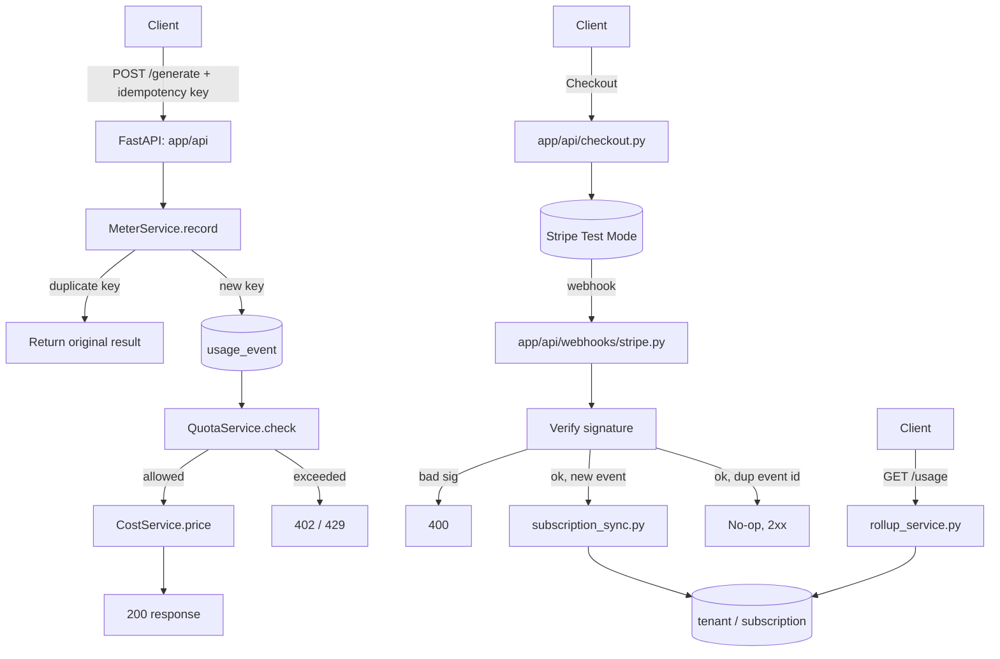

# Architecture Diagram

Kept in sync with `docs/architecture.md`'s flow — update both together.

Paste a rendered PNG/SVG export of this into the README once the app
exists, if the grader's viewer doesn't render Mermaid inline.
