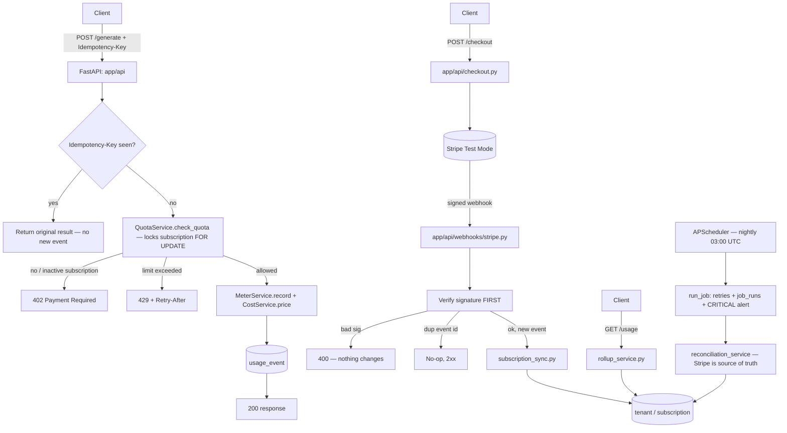

# Architecture Diagram

Kept in sync with `docs/architecture.md`'s flow — update both together.

Quota check happens **before** the usage event is written (a rejected request
never persists a row). `usage_query.py` is the single source of the "used so
far this period" numbers for both `QuotaService` and `RollupService`.

Paste a rendered PNG/SVG export of this into the README once the app
exists, if the grader's viewer doesn't render Mermaid inline.
